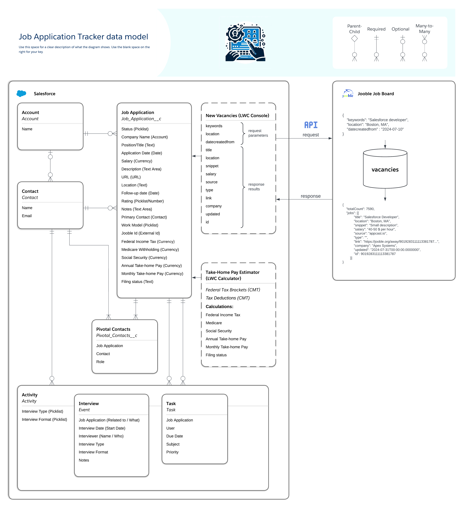

# Job Application Tracker on Salesforce 🚀

Dive into the Salesforce platform and channel its capabilities to redefine your job application tracking experience. This capstone project, a part of Cloud Code Academy's curriculum, aims to cultivate a proficient Salesforce developer out of you.

## About This Project 📖

Job searching can often become chaotic. With this project, we bring structure and efficiency into the process. Using Salesforce's versatile capabilities, you'll be building features that keep track of applications and add layers of automation, integration, and validation.

Key Features:
- Reminders: Set automated reminders for upcoming interviews, follow-ups, or essential dates.
- Validations: Assure the integrity of data with programmatic validations.
- Salary Calculations: Implement dynamic functionalities for salary calculations based on set parameters.
- Integration with Job Boards: Sync your application seamlessly with top job boards for updated tracking.

Navigating the Project 🧭

- Team or Solo: Opt to face this challenge solo or form a powerhouse team of up to three.
- Organizational Setup: Work within individual Salesforce orgs and religiously update the designated GitHub repository.
- Collaborate, But Stand Alone: While collaboration is the essence, ensure your team understands every project aspect.
- Reach Out: The ambiguous nature of requirements simulates the real world. Always clarify doubts with your instructor.

Key Recommendations 📝

- Embrace Ambiguity: Not all requirements might see completion - and that's okay!
- Management Tools: Organize and prioritize using tools like Trello or Jira.
- Code Over Click: Although tempting, emphasize coded solutions over Salesforce's declarative features.
- Fresh Start: Start with a fresh Trailhead Playground or Developer org to avoid existing automation or configuration.

## Project Description

### Entity Relationship Diagram



### Installation

1. Set up your environment.
2. Clone the repository

```zsh
git clone https://github.com/Cloud-Code-Academy/job-tracker-oxana-suvorova.git
cd job-tracker-oxana-suvorova
```

3. Authorize with your org and provide it with an alias (<strong>jobapptracker</strong> for example)

```zsh
sf org login web --set-default --alias jobapptracker
```

4. Deploy the Project to your org

```zsh
sf project deploy start
```

5. Assign the Job_Application_Tracker_Permissions permission set to the default user

```zsh
sf org assign permset --name Job_Application_Tracker_Permissions
```

6. Open the Org

```zsh
sf org open
```
